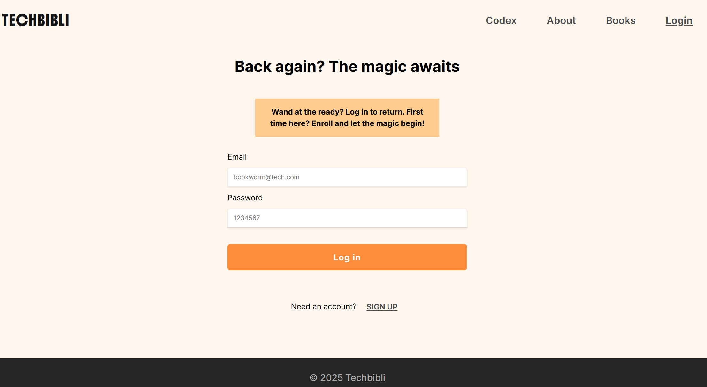
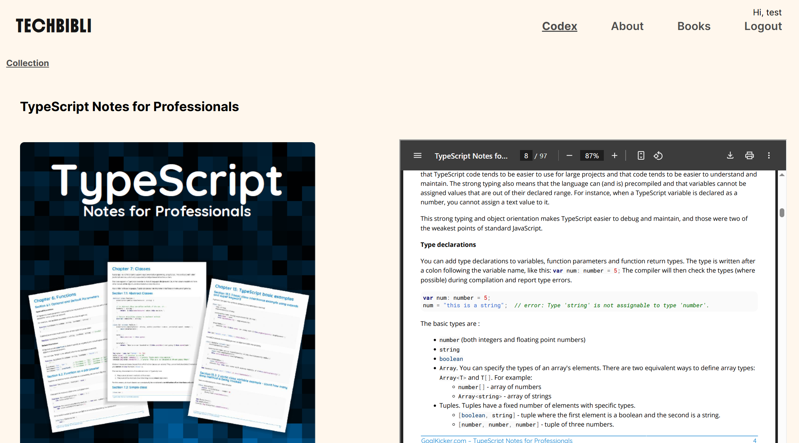

# 📚 TechBibli – The Codex of Tomorrow

> A curated library of technology books designed to spark innovation and preserve knowledge. TechBibli offers a members-only space where wisdom is shared, ideas evolve, and the future is written.

---

## Table of Contents

- [General Info](#general-info)
- [Screenshots](#screenshots)
- [Technologies](#technologies)
- [Setup](#setup)
- [Code Examples](#code-examples)
- [Features](#features)
- [To-Do List](#to-do-list)
- [Project Status](#project-status)
- [Contact](#contact)

---

## General Info

TechBibli is a dedicated platform for discovering and sharing technology-focused books. It serves as a hub where enthusiasts and professionals alike can explore curated knowledge and contribute their own insights. With a well-organized public catalog and an exclusive members-only area, TechBibli connects timeless tech wisdom with tomorrow’s innovations.

---

## Screenshots




---

## Technologies

- React (v18+)
- JavaScript (ES6+)
- HTML5
- CSS3
- Firebase (for authentication & database)
- Visual Studio Code (IDE)

---

## Setup

1. Clone this repository:

   ```sh
   git clone https://github.com/boba-milktea/techbibli.git
   ```

2. Navigate to the project folder:

   ```sh
   cd techbibli
   ```

3. Install dependencies:

   ```sh
   npm install
   # or
   yarn
   ```

4. Start the development server:

   ```sh
   npm run dev
   # or
   yarn dev
   ```

5. Open the app in your browser:
   http://localhost:5173

---

## Code Examples

```js
const getDocuments = async () => {
  const snapshot = await getDocs(collectionRef);

  const documents = snapshot.docs.map((doc) => ({
    ...doc.data(),
    id: doc.id,
  }));
  return documents;
};

const getDocument = async (id) => {
  const docRef = doc(db, collect, id);
  const snapshot = await getDoc(docRef);
  const document = { ...snapshot.data(), id: snapshot.id };
  return document;
};
```

## Features

- User authentication with Firebase (sign up, login, logout)

- Save user-specific book notes or reviews

- Store and fetch data using Firebase Firestore

- filter books by category

- Responsive UI with a clean and modern design

- Navigation with protected routes (for logged-in users)

## To Do

- Improve form validation (e.g., password strength, required fields)

- Add password reset functionality

- Improve mobile responsiveness and accessibility

- Add unit tests for key components (e.g., Auth, BookList, etc.)

- Add ability to add and edit existing book entries

## Project Status

Project is: ✔️ Base project completed

## Contact

By [boba-milktea](https://github.com/boba-milktea)
